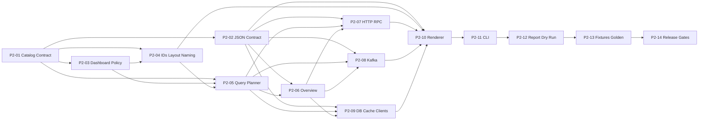

# Phase 2 - Dashboard Generator Jira Stories

## 文档信息

| 字段 | 内容 |
| --- | --- |
| 状态 | Draft |
| 目标版本 | `v0.3.0` |
| 计划周期 | 4 周（有条件） |
| 更新日期 | 2026-08-10 |
| 上游基线 | Phase 0 已发布；Phase 1 `v0.2.0` 的 IR、Generation Plan、`metrics.yaml` 与 `otel.yaml` 契约已通过发布检查 |
| 目标读者 | Product Owner、Tech Lead、Go 开发人员、QA、SRE、Grafana 管理员 |

## 1. Phase 目标

Phase 2 将 Phase 1 已验证的 `ObservabilityDocument` 和其中的
`GenerationPlan` 转换为可导入 Grafana 的、确定性 `dashboard.json`。它不重新
扫描源码、不连接 Prometheus 或 Grafana，也不臆造 Phase 1 未声明的 Metric、Span
或 Label。

```text
Source Code
    -> Language Analyzer
    -> ObservabilityDocument + GenerationPlan
    -> Dashboard Catalog and Query Planner
    -> Grafana Dashboard Model
    -> Validate and Render
    -> dashboards/dashboard.json
```

### 1.1 用户价值

- 服务维护者可从代码分析结果获得可导入的 HTTP、RPC、Kafka、数据库与缓存看板，减少手写 PromQL 和重复布局工作。
- 每个图表可追溯到稳定的 Plan ID、Metric ID 或 Span ID；当 Phase 1 不支持某个信号时，生成稳定 Diagnostic 而不是虚构查询。
- 以确定的 JSON 输出纳入 Git 审查，便于团队比较 Dashboard 的变更影响。
- 为 Phase 3 SLO/Alert、Phase 4 Runbook 与后续 Runtime 集成提供统一 Dashboard UID、Panel ID 和深链接目标。

### 1.2 成功标准

1. `si dashboard [path]` 对有效 Phase 1 输入默认生成一个可导入的 `dashboards/dashboard.json`。
2. Dashboard 至少包含 HTTP、gRPC、Kafka、SQL、Redis、HTTP Client 与 RPC Client 的适用概览；没有实体的类别不产生空行或空 Panel。
3. 每个 Query 引用的 Metric 名称、Label 和 Operation 都能回溯到输入的 `GenerationPlan`；不引用原始 URL、SQL、Redis Key、Kafka payload 或其他敏感值。
4. 相同 IR、Policy、CLI 版本与模板版本连续运行 10 次，输出 bytes、Dashboard UID 和 Panel ID 完全一致。
5. 无网络、无 Grafana、无 Prometheus 时仍可完成生成和本地 JSON/语义校验。
6. 无效 IR、Plan、Dashboard Policy、模板或跨对象引用在写入前失败，且不留下部分文件。
7. Phase 0 `si scan` 与 Phase 1 `si generate` 的 CLI 契约、输出和退出码不回归。

### 1.3 产品结果指标

| 指标 | Phase 2 目标 |
| --- | --- |
| 已识别实体到 Dashboard 分类的覆盖率 | 100%：生成 Panel 或返回稳定 Diagnostic |
| Query 到 Plan 定义的可追溯率 | 100% |
| Golden fixture 确定性 | 10 次运行无字节差异；25 个输入排列语义相等 |
| 无数据类别产生空 Panel | 0 |
| 未经计划声明的 Metric/Label | 0 |
| 敏感 canary 值进入 JSON、stdout、stderr 或错误消息 | 0 |
| 生成期间的网络请求 | 0 |

## 2. 范围与架构决策

### 2.1 In Scope

- 在独立 Dashboard Generator package 中消费已验证的 `ObservabilityDocument` 与 `GenerationPlan`。
- 定义封闭、版本化的 Dashboard Policy、Dashboard Catalog、Grafana JSON model 与本地 Validator。
- 生成服务概览及 HTTP、gRPC、Kafka、Database、Cache 五类逻辑 Dashboard 区域；客户端调用归入对应外部依赖区域。
- 生成受控的 Counter、Histogram、Gauge 和 Trace/Span 关联 Query；所有 Query 基于 Phase 1 计划的 Metric 名、属性与目标 ID。
- 生成确定性的变量、行、Panel、链接、注释和 No-data 行为。
- 新增离线 `si dashboard` 命令、`--dry-run`、`--force`、`--strict`、`--format json` 与安全文件提交。
- 增加 JSON Schema、fixtures、Golden、导入兼容性、性能、安全和发布质量门禁。

### 2.2 Out of Scope

- 连接、认证、导入或部署 Grafana、Prometheus、Tempo、Loki、Mimir、Datadog 或 New Relic。
- 从运行时指标、Trace 或日志中发现新服务、自动调节阈值，或验证 Query 有实际数据。
- 自动生成 SLO、SLI、Alert Rule、Runbook、Collector 配置或用户源码修改。
- 用户自定义 Go template、JavaScript、HTML、Panel plugin、任意 URL、任意 PromQL 或远程模板下载。
- Phase 1 之外的语言分析、Metric 插桩、Kafka Handler Root Span 推断，或基于原始 Dependency 值推断 Query label。
- 多 Dashboard 文件、文件夹权限、Grafana provisioning、Dashboard version 冲突处理或历史迁移。

> **边界说明：** Phase 2 交付的是 Grafana Dashboard 定义，不是运行时数据、更不是已部署 Dashboard。若某项 Phase 1 Plan 不能安全映射为 Dashboard Query，必须生成稳定 Diagnostic；不得以猜测的 Metric、Label 或敏感字段补齐。

### 2.3 输入所有权与固定调用链

| 层 | 输入 | 输出 | 禁止事项 |
| --- | --- | --- | --- |
| Analyzer | Source Code | `ObservabilityDocument` | 不生成 Dashboard 或 PromQL |
| Phase 1 Planner | IR + Generator Policy | `GenerationPlan` | 不读 Dashboard 模板或 Grafana 配置 |
| Dashboard Catalog | 已验证 IR + Plan | 可追溯 Dashboard Item | 不读取 AST、网络或源代码文件 |
| Query Planner | Catalog + Dashboard Policy | Typed Query/Panel Plan | 不拼接未验证用户输入 |
| Renderer | Dashboard Plan | 内存 JSON bytes | 不写文件、不查询后端 |
| CLI Writer | 已验证 bytes | `dashboard.json` | 不修改 Plan 或 Dashboard 内容 |

固定调用链：

```text
Analyze -> Validate IR -> Build GenerationPlan -> Validate Plan
        -> Build Dashboard Catalog -> Validate Catalog -> Plan Queries/Panels
        -> Validate Dashboard Model -> Render JSON -> Validate Rendered JSON
        -> Commit File
```

任一 fatal error 均阻止后续阶段和文件写入。`si dashboard` 可在内存调用 Analyzer 与
Phase 1 Planner，但 Dashboard package 的生产代码不得导入 `compiler/goanalyzer`、
`go/ast`、`go/types` 或 `go/packages`。

### 2.4 输出与兼容性契约

默认输出目录为 `<source-root>/dashboards`，默认仅管理：

| 文件 | Schema | 内容 |
| --- | --- | --- |
| `dashboard.json` | `grafana.dashboard/v1` | 单一服务的 Grafana dashboard model、变量、行、Panel、Query 和 Dashboard metadata |

该 JSON 是 Grafana dashboard API/export model 的离线子集，并固定以下约束：

- `schemaVersion` 固定为经兼容性测试确认的 Grafana Schema `41`；任何升级须发布新的 `grafana.dashboard/vN` 契约并重新执行导入兼容性测试。
- `id` 固定为 `null`，`version` 固定为 `0`，禁止包含 Grafana server 分配的 ID、dashboard version、生成时间、用户、主机名和绝对路径。
- `uid`、Panel `id`、Row `id` 均由 service 与稳定 Plan ID 的规范化值确定，不使用随机 UUID 或计数器碰撞消解。
- 顶层 annotations、links、templating、panels、targets 与 schema fields 均使用 typed model；未知 JSON 字段、重复 key、非有限数值、`__inputs`、任意 HTML/JavaScript 和外部数据源配置一律拒绝。
- Datasource 使用受控常量 `${datasource}`，由导入者在 Grafana UI 选择；不包含 endpoint、token、tenant 或 credential。
- 输出必须能被 Phase 2 固定的 Grafana compatibility fixture 解析；本期不依赖运行中的 Grafana。

### 2.5 Dashboard 分类、Panel 与查询规则

| 类别 | 触发条件 | 必须生成的 Panel | 主要信号 |
| --- | --- | --- | --- |
| Service Overview | 至少一个可 Dashboard 化的 Endpoint/Dependency | Requests/operations rate、error ratio、p50/p95/p99 duration、in-flight、top failing operations | Metrics；可选 Trace link |
| HTTP | HTTP Handler | request rate、error ratio、latency heatmap/percentiles、in-flight、operation breakdown | Endpoint Metrics + SERVER Span |
| RPC | gRPC Handler 或 RPC Client | request/call rate、error ratio、latency percentiles、method breakdown | Endpoint/Dependency Metrics + Span |
| Kafka | Kafka Producer 或 Consumer API | operation rate、error ratio、duration、operation/topic-safe category breakdown | Dependency Metrics + PRODUCER/CONSUMER Span |
| Database | SQL | operation rate、error ratio、duration、operation breakdown | Dependency Metrics + CLIENT Span |
| Cache | Redis | command rate、error ratio、duration、operation breakdown | Dependency Metrics + CLIENT Span |

Panel 仅在其每个必需 Query 均可由 Plan 证明时生成。没有 Histogram 时不生成 percentile
Panel；没有 Gauge 时不生成 in-flight Panel；没有相关 Span ID 时不生成 Trace deep link。Dashboard
可以保留没有 Panel 的分类摘要 Diagnostic，但不得留空 Row。

PromQL 规则：

1. Metric selector 名必须来自对应 `MetricPlan.name`；`service`、`operation`、`status` label 必须存在于该 Metric Plan 的 Attribute Binding。
2. Rate 窗口来自固定、可配置且严格校验的 Dashboard Policy；默认 `$__rate_interval`。百分位仅对 Histogram bucket 生成，并使用 `histogram_quantile` + `sum by (le, operation)`。
3. Error ratio 的分子只聚合 `status=~"error|timeout|cancelled|unknown"`；分母聚合该计划声明的同一 operation 集合。若状态 vocabulary 或 Attribute 不满足条件，省略该 Panel 并生成 `DASHBOARD_MISSING_REQUIRED_METRIC`。
4. Query 中不得使用 `label_values`、用户提供的原始正则、字符串拼接的服务值、原始 target URL/SQL/Key/Topic。变量筛选仅使用受控 `service` 与已验证的低基数 `operation` 值。
5. Trace link 只可使用固定 `traces` datasource 变量与 Plan Span 的 static name/target metadata；不携带 request ID、trace ID、endpoint host 或动态参数。

### 2.6 Dashboard 配置草案

Phase 2 在现有 `si.yaml` 中新增可选 `dashboard` 节点，合并优先级固定为：

```text
CLI flags > si.yaml > built-in defaults
```

```yaml
dashboard:
  output_dir: dashboards
  title_suffix: Observability
  datasource_variable_name: datasource
  include_trace_links: true
  include_client_dependencies: true
  rate_interval: $__rate_interval
  timezone: browser
  refresh: 30s
  max_panels: 200
  max_queries: 500
  strict: false
```

- `output_dir`、`title_suffix`、`datasource_variable_name`、`include_trace_links`、`include_client_dependencies`、`rate_interval`、`timezone`、`refresh`、`max_panels`、`max_queries` 与 `strict` 均为强类型字段。
- `datasource_variable_name` 必须匹配 `[A-Za-z_][A-Za-z0-9_]{0,31}`，且保留变量 `datasource` 不可删除；v1 只允许值 `datasource`。
- `rate_interval` v1 只允许 `$__rate_interval`；`timezone` 只允许 `browser` 或 `utc`；`refresh` 只允许 `5s`、`10s`、`30s`、`1m`、`5m`、`15m`、`30m`、`1h` 或 `off`。
- `max_panels` 默认 `200`、硬上限 `1000`；`max_queries` 默认 `500`、硬上限 `5000`。超过限额必须失败，禁止截断。
- 未设置的 bool 必须与显式 `false` 区分；不读取环境变量、Grafana 配置、当前工作目录、用户名或 Git 信息改变生成内容。

### 2.7 Diagnostic、退出码与报告

| Code | 默认级别 | 含义 | `--strict` 行为 |
| --- | --- | --- | --- |
| `DASHBOARD_UNSUPPORTED_SCHEMA` | Error | IR、Plan 或 Dashboard schema 不被支持 | 失败 |
| `DASHBOARD_INVALID_IR` | Error | 输入 IR 或 Plan 结构无效 | 失败 |
| `DASHBOARD_INVALID_CONFIG` | Error | Dashboard 配置无效或超出限制 | 失败 |
| `DASHBOARD_DANGLING_REFERENCE` | Error | Query/Panel/Link 引用不存在的 Plan 项 | 失败 |
| `DASHBOARD_MISSING_REQUIRED_METRIC` | Warning | 某个可选 Panel 所需 Metric/label 未被 Plan 声明 | 失败 |
| `DASHBOARD_UNSUPPORTED_TARGET` | Warning | 实体未有安全的 v1 Dashboard 映射 | 失败 |
| `DASHBOARD_EMPTY_CATEGORY` | Info | 分类没有可生成 Panel，Row 被省略 | 不失败 |
| `DASHBOARD_PANEL_LIMIT_EXCEEDED` | Error | 预计 Panel 或 Query 数超过 Policy 上限 | 失败 |
| `DASHBOARD_NAME_COLLISION` | Warning | 规范化后的 UID、变量或标题冲突并稳定消歧 | 失败 |
| `DASHBOARD_SENSITIVE_VALUE_DROPPED` | Warning | 潜在敏感 IR 值被阻止进入 Dashboard | 失败 |
| `DASHBOARD_RENDER_ERROR` | Error | Typed model 无法渲染/校验为合法 JSON | 失败 |
| `DASHBOARD_OUTPUT_EXISTS` | Error | 未指定 `--force` 且目标已存在 | 失败 |
| `DASHBOARD_UNSAFE_TARGET` | Error | 输出目标为 symlink 或非普通文件 | 失败 |

退出码：`0` 为成功（non-strict 可带 Warning）；`1` 为 analyze、plan、render、validate
或 commit 失败；`2` 为参数、路径或配置错误。`si dashboard --format json` 在 flags
解析成功后向 stdout 输出且仅输出一个 `cli.dashboard_report/v1` JSON 文档，stderr
为空；flag 语法错误沿用现有文本 stderr 语义。

## 3. Epic、Story 与依赖

### 3.1 Epic 列表

| Epic | 目标 |
| --- | --- |
| `P2-CONTRACT` | 固定 Dashboard 输入、Policy、Grafana JSON 和可追溯性契约 |
| `P2-QUERY` | 从 Phase 1 Plan 安全生成可验证的 Metric/Trace Query |
| `P2-PANELS` | 实现五类 Dashboard Panel 与确定性布局 |
| `P2-CLI` | 提供安全、离线、确定的 `si dashboard` 工作流 |
| `P2-QUALITY` | 建立 fixture、Golden、兼容性、性能与发布质量门禁 |

### 3.2 Story 总览

| Story | 标题 | Epic | 优先级 | SP | 依赖 |
| --- | --- | --- | ---: | ---: | --- |
| P2-01 | 定义 Dashboard 输入、Catalog 与可追溯性契约 | P2-CONTRACT | Highest | 5 | Phase 1 DoD |
| P2-02 | 定义 Grafana Dashboard JSON v1 契约与严格校验器 | P2-CONTRACT | Highest | 5 | P2-01 |
| P2-03 | 实现 Dashboard Policy 与严格配置合并 | P2-CONTRACT | Highest | 3 | P2-01 |
| P2-04 | 实现确定性 UID、Panel ID、布局与安全命名 | P2-CONTRACT | Highest | 3 | P2-01, P2-03 |
| P2-05 | 实现 Plan 驱动的 PromQL 与 Trace Link Query Planner | P2-QUERY | Highest | 5 | P2-01, P2-03, P2-04 |
| P2-06 | 生成 Service Overview 与受控变量 | P2-PANELS | High | 3 | P2-02, P2-05 |
| P2-07 | 生成 HTTP 与 gRPC Dashboard Panels | P2-PANELS | High | 5 | P2-02, P2-05, P2-06 |
| P2-08 | 生成 Kafka Dashboard Panels | P2-PANELS | High | 3 | P2-02, P2-05, P2-06 |
| P2-09 | 生成 Database、Cache 与客户端依赖 Panels | P2-PANELS | High | 5 | P2-02, P2-05, P2-06 |
| P2-10 | 渲染并验证确定性 `dashboard.json` | P2-PANELS | Highest | 3 | P2-02, P2-04, P2-07, P2-08, P2-09 |
| P2-11 | 实现 `si dashboard` 与安全单文件提交 | P2-CLI | Highest | 5 | P2-10 |
| P2-12 | 实现 Dashboard Report、dry-run 与严格失败语义 | P2-CLI | High | 3 | P2-11 |
| P2-13 | 建立 Dashboard fixture、Golden 与导入兼容性测试 | P2-QUALITY | Highest | 5 | P2-12 |
| P2-14 | 建立质量门禁、性能基线与发布检查 | P2-QUALITY | High | 3 | P2-13 |

总建议工作量为 **56 SP**。该估算依赖至少 4 名可并行开发人员及可参与
Grafana 兼容性验收的 SRE；若近四周交付速度不足 56 SP，应调整为 6 至 8 周，而不是
删除安全、兼容性或发布 Story。

### 3.3 依赖图



### 3.4 四周条件排期

| 周次 | 主要目标 | 可并行工作 |
| --- | --- | --- |
| Week 1 | 完成 P2-01；冻结 P2-02、P2-03、P2-04 契约 | JSON schema、fixture scaffold、Grafana compatibility corpus 可并行 |
| Week 2 | 完成 P2-05、P2-06；启动 P2-07、P2-08、P2-09 | Query planner 与三类 Panel 按分类并行开发 |
| Week 3 | 完成 P2-07 至 P2-10；接入 P2-11 | renderer contract、CLI fault injection、Golden harness 同步实现 |
| Week 4 | 完成 P2-12 至 P2-14 | 跨平台、确定性、canary、性能、release candidate 演练；不接受契约级范围变更 |

## 4. 统一 Jira 标准

### 4.1 Definition of Ready

Story 进入开发前必须满足：

- 用户价值、In Scope、Out of Scope、依赖、输入/输出与失败语义已明确。
- 所有新增 JSON、PromQL、Grafana schema 与 Policy 默认值已经由 Tech Lead 和 SRE 确认。
- 验收标准可离线独立测试，不使用“正常工作”“合理”“适当”等不可验证描述。
- 所需 Phase 1 fixture、Plan ID 与 Metric/Span 映射已经存在，或明确属于本 Story。
- 单个 Story 不跨越两个不可独立发布的架构层；超过 8 SP 必须继续拆分。
- 对来源、敏感数据、Query 注入、Dashboard import 兼容性和性能的风险已有可执行测试方案。

### 4.2 全局 Definition of Done

每个 Story 除自身 DoD 外，均必须满足：

- 生产代码、测试、schema、fixture 和文档在同一个 Pull Request 中完成。
- 新增公开 Go 类型、函数、Protobuf 字段与 JSON 字段有导出说明；不使用 `any`、无约束 `map[string]interface{}` 或吞掉错误的分支。
- 错误带阶段、稳定 ID 与字段路径上下文；面向用户的错误带稳定 code，且不回显敏感值。
- 覆盖 Happy Path、边界条件和 Error Path；测试无网络、无时钟、无随机值、无绝对路径依赖。
- 相关 `go test`、`go vet`、race、schema、Golden 和 import compatibility 测试通过。
- 相同输入生成的 bytes、UID、Panel ID、Query 顺序和 Diagnostic 顺序保持一致。
- Dashboard 生产包不导入 Analyzer/AST 包，不引入共享可变全局状态，不访问环境变量或网络。
- PR 描述包含验收证据、测试命令、Grafana 兼容性影响、PromQL 变更和已知限制。

## P2-01 定义 Dashboard 输入、Catalog 与可追溯性契约

**Issue Type：** Story  
**Epic：** P2-CONTRACT  
**优先级：** Highest  
**建议工作量：** 5 SP  
**依赖：** Phase 1 Definition of Done  
**阻塞：** P2-02、P2-03、P2-04、P2-05  
**Labels：** `phase-2`、`dashboard`、`contract`、`generation-plan`

### 用户故事

作为 Dashboard Generator 开发者，我需要一个只消费已验证 IR 与 Generation Plan 的强类型 Catalog，使每个 Dashboard Item、Panel 和 Query 都能稳定追溯到 Phase 1 的实体与信号。

### 业务价值

- 消除 Dashboard 层重新分析源码、重复命名和重复安全判断的风险。
- 让 Phase 3 Alert/SLO 与 Phase 4 Runbook 能可靠引用同一 target、metric、span 和 dashboard item。
- 将“数据缺失”与“无法安全映射”明确区分，避免面板看似可用但查询并不成立。

### In Scope

- 定义强类型 `DashboardCatalog`、`DashboardItem`、`SignalReference`、`PanelCapability`、`QueryCapability` 与 `DashboardDiagnostic`。
- 建立 Endpoint、Dependency、Function、CallEdge 到五类 Dashboard category 的确定映射。
- 为每个 Catalog Item 保存 source target ID、function ID、Metric Plan ID/name、Span Plan ID/name、允许的低基数 labels 和 provenance。
- 验证 IR/Plan version、target kind、target ID、Plan ID 唯一性和 Plan-to-IR 引用完整性。

### Out of Scope

- Grafana JSON 字段、Panel 可视化、PromQL 拼接、文件提交或 CLI flags。
- 重新扫描源码或根据 Dependency 原始值推断 categories/operations。
- 对未声明的 Metric/Span 进行补全或猜测。

### 实现任务

1. 新增独立 `dashboard` package，输入为 `*observabilityv1.ObservabilityDocument` 与不可变 Dashboard Policy；不得接收 AST、源码路径或 Analyzer option。
2. 定义 `DashboardCatalog`，明确 `schema_version`、`source_ir_schema_version`、`generation_plan_schema_version`、service、稳定有序 items 与 diagnostics。
3. 定义 `DashboardItem`：稳定 ID、category、target ref、function ID、display name、operation、Metric/Span references、capabilities 与可追溯 source paths。
4. 固定 category 映射：HTTP Handler -> HTTP；gRPC Handler -> RPC；Kafka Producer/Consumer -> Kafka；SQL -> Database；Redis -> Cache；HTTP/RPC Client -> 对应客户端 category，仅在 Policy 允许时进入概览和分类区域。
5. 从 `MetricPlan` 读取 name、type、unit、attribute bindings、function ID 与 target；从 `SpanPlan` 读取 ID、name、kind、target 和 status policy；不得读取或复制安全策略阻止的 Dependency 值。
6. 建立 capability：rate 需要 Counter + `service`/`operation`；error ratio 需要 status attribute；percentile 需要 Histogram + buckets；in-flight 需要 Gauge；trace link 需要适配 Span。
7. 对 absent Plan、未知 schema、重复 item ID、Plan target kind 不匹配、无效 label 及无法安全映射的 Dependency 生成稳定错误或 Diagnostic。
8. 对所有集合按 category、target kind、target ID、plan ID 排序；Catalog builder 不修改输入 proto。
9. 写入 package 文档，说明 Catalog 是 Dashboard 的唯一业务输入，以及 Query 必须经 capability gate。

### 验收标准

#### AC1：完整 Plan 可形成可追溯 Catalog

- **Given** 一个含 HTTP、gRPC、Cron、Kafka、SQL、Redis、HTTP Client、RPC Client 与对应 Metric/Span Plan 的复合 IR fixture
- **When** 构建 Dashboard Catalog
- **Then** 每个可支持实体都产生一个稳定 item，且每个 Metric/Span reference 都回指有效 Plan ID 与同一 target

#### AC2：非法引用被拒绝

- **Given** Plan target kind/ID 不匹配、重复 Plan ID 或引用不存在实体的 fixture
- **When** 运行 Catalog builder
- **Then** 返回 `DASHBOARD_INVALID_IR` 或 `DASHBOARD_DANGLING_REFERENCE`，错误含字段路径与 ID，不返回部分 Catalog

#### AC3：无依据的 Panel 能力不可用

- **Given** 只含 Counter、没有 Histogram、Gauge、status label 或 Span 的 item
- **When** 构建 capability
- **Then** rate 可用，其余 capability 为不可用并附可解释原因；后续 Planner 不会生成对应 Panel

#### AC4：敏感值不进入 Catalog

- **Given** Dependency 的 target URL、SQL、Redis key、Kafka payload、token 和 email canary fixture
- **When** 构建 Catalog
- **Then** Catalog、Diagnostic 和错误均不包含 canary 值；每个阻止动作产生稳定 `DASHBOARD_SENSITIVE_VALUE_DROPPED` Diagnostic

#### AC5：输入排列不影响语义

- **Given** 同一复合 IR 的 25 个固定排列
- **When** 分别构建 Catalog
- **Then** 排序后的 Catalog、capability 与 diagnostics 完全相等

### 测试要求

- Table-driven tests：每个 Endpoint/Dependency kind、每种 capability、缺失 Plan、类型不匹配与重复 ID。
- Property test：输入排序/排列不改变输出；builder 不变更输入 proto。
- Canary tests：所有敏感字段路径。
- Import boundary test：`dashboard` package 不导入 compiler、AST 或 packages。

### 非功能与安全要求

- Catalog 构建时间复杂度为 $O(P + E + D)$，其中 $P$ 为 Plan 项数、$E$ 为 Endpoint 数、$D$ 为 Dependency 数。
- 内存仅保存 Dashboard 必需的受控 metadata；不得保留原始 Dependency 内容供后续“方便使用”。

### Story DoD

- Catalog typed model、validator、fixture、package 文档和所有 AC 测试已提交。
- Tech Lead 与 SRE 完成 target/category/provenance review。

## P2-02 定义 Grafana Dashboard JSON v1 契约与严格校验器

**Issue Type：** Story  
**Epic：** P2-CONTRACT  
**优先级：** Highest  
**建议工作量：** 5 SP  
**依赖：** P2-01  
**阻塞：** P2-06、P2-07、P2-08、P2-09、P2-10  
**Labels：** `phase-2`、`grafana`、`json-schema`、`validation`

### 用户故事

作为 Grafana Dashboard 消费者，我需要封闭、版本化且可离线严格校验的 JSON 契约，使导入前即可发现不兼容字段、错误 Panel 引用和危险内容。

### 业务价值

- 将 Dashboard 作为稳定 API，而不是未经约束的 JSON blob。
- 在 CI 中提前捕获 Grafana schema 漂移、坏 Query target、重复 Panel ID 和不安全链接。
- 让后续模板演进可通过显式 version 协商完成。

### In Scope

- 定义 typed Grafana dashboard v1 model、JSON Schema 与严格 Decoder/semantic Validator。
- 覆盖 dashboard metadata、templating、rows、timeseries/stat/gauge/table panels、targets、field config、links、annotations 和受控 datasource variable。
- 建立 Grafana Schema `41` 的固定 compatibility corpus 与 canonical JSON 规则。

### Out of Scope

- 支持任意 Grafana plugin、library panel、alert、transformation、HTML/text script、provisioning 或 Grafana API 导入。
- 运行时访问 Grafana 或动态同步其 schema。

### 实现任务

1. 在 `dashboard/model` 或等价 package 定义强类型 top-level model，固定 `schemaVersion: 41`、`id: null`、`version: 0` 与 `editable: true`。
2. 定义 typed `Dashboard`, `Templating`, `Variable`, `Row`, `Panel`, `GridPos`, `Target`, `DatasourceRef`, `FieldConfig`, `Link`, `Annotation` 与 `QueryMetadata`；严禁顶层或 Panel 使用 `map[string]any`。
3. 允许 Panel type 仅为 `timeseries`、`stat`、`gauge`、`table` 和 `row`；拒绝 text、plugin ID、未识别 type 和任意 options passthrough。
4. 对所有 target 强制 datasource `${datasource}`，format 为 `time_series`，refId 按 `A` 至 `Z` 受控分配；单 Panel target 数上限为 26。
5. 定义 machine-readable schema：`schemas/dashboard/v1/grafana-dashboard.schema.json`，关闭 `additionalProperties`，并为可选对象设定明确上限。
6. Decoder 拒绝未知字段、重复 JSON key、非有限数值、过深嵌套、过大 document、无效 UTF-8 与 `__inputs`/`__requires` 等不支持字段。
7. Semantic Validator 校验 UID、title、Panel ID、grid bounds、row/panel nesting、target refId、datasource variable、Query metadata、link allowlist、唯一性及所有跨引用。
8. Canonical renderer 固定对象字段和数组顺序，使用 two-space indentation、尾随 LF、无 HTML escaping，禁止 timestamp 和空的可选字段。
9. 提交最小/完整/无效 JSON fixture 与本地 compatibility corpus；corpus 至少覆盖导入所需的 row、timeseries、stat、gauge、table、变量和 datasource reference。
10. 文档化 v1 字段封闭规则：新增、删除、重命名字段或 Grafana schema 升级必须新建 `grafana.dashboard/vN`，不能以 optional field 绕过协商。

### 验收标准

#### AC1：完整 v1 Dashboard 严格往返

- **Given** 覆盖全部允许 Panel 类型和字段的有效 fixture
- **When** 严格 decode、语义校验、canonical render、再次 decode
- **Then** 两次 model 语义相等，bytes 稳定且无 Warning

#### AC2：不支持字段无法静默通过

- **Given** 含未知字段、重复 `uid`、`__inputs`、HTML panel、plugin type 或 `map` 形式 datasource 的 JSON fixture
- **When** 执行 Decoder/Validator
- **Then** 每个 fixture 均失败，错误包含 JSON path 和规则，不回显完整文档

#### AC3：结构与引用被验证

- **Given** 重复 Panel ID、越界 grid、错误 refId、错误 variable、外部 datasource URL 或无效 link 的 fixture
- **When** 执行 semantic validation
- **Then** 失败并定位到对应 panel/target/link

#### AC4：Grafana compatibility corpus 通过

- **Given** 固定的 Grafana Schema 41 compatibility fixture
- **When** 用本地 v1 renderer 生成等价 Dashboard 并运行 corpus validator
- **Then** 输出满足所有导入必须字段和结构约束，无需运行 Grafana

#### AC5：渲染确定

- **Given** 一个完整 typed Dashboard model
- **When** 连续渲染 10 次
- **Then** bytes 完全一致，不含时间、随机值、服务器 ID 或主机信息

### 测试要求

- Unit tests：全部字段、限制、JSON path、跨引用与 canonical ordering。
- Fuzz tests：Decoder 不 panic、不接受重复 key 或非有限 number，且受 10 MiB 文件/64 层深度上限保护。
- Contract tests：Go Validator 与 JSON Schema 对同一 fixture 的 pass/fail 结论一致。
- Documentation contract tests：抽取本 Story 的 JSON fences，解析并验证。

### 非功能与安全要求

- 最大 Dashboard 输入/输出为 10 MiB；超过上限返回稳定错误。
- Validator 必须线性遍历 JSON/model，禁止超线性字符串拼接或正则回溯风险。
- 不允许任何可执行 Dashboard 内容或外部 URL 数据源。

### Story DoD

- typed model、schema、decoder、validator、compatibility corpus、fixtures 与测试已提交。
- SRE 完成 Grafana Schema 41 import compatibility review。

## P2-03 实现 Dashboard Policy 与严格配置合并

**Issue Type：** Story  
**Epic：** P2-CONTRACT  
**优先级：** Highest  
**建议工作量：** 3 SP  
**依赖：** P2-01  
**阻塞：** P2-04、P2-05  
**Labels：** `phase-2`、`configuration`、`policy`

### 用户故事

作为服务维护者，我需要通过 `si.yaml` 选择低风险 Dashboard 表现参数，同时保证不同机器和不同执行者生成相同结果。

### 业务价值

- 允许团队统一刷新频率、时区、输出目录与受控 trace links，而不接受注入式 Query/模板自定义。
- 通过严格合并与限额防止错误配置生成巨大或不安全的 Dashboard。

### In Scope

- `dashboard` 节点的强类型配置、默认值、严格解析、CLI/YAML/default 合并、归一化、validation 与 policy digest。
- 文档化最小配置、完整配置与无效示例。

### Out of Scope

- 任意 PromQL、Grafana JSON、URL、custom template、远程下载、凭据或 Grafana endpoint 配置。
- 实际 CLI command 注册和输出提交。

### 实现任务

1. 定义 `DashboardConfig` 与不可变 `DashboardPolicy`；使用 optional/pointer 语义区分 absent 与显式 `false`。
2. 实现第 2.6 节的所有默认值、枚举值与 hard limits。
3. 在现有 `si.yaml` loader 严格识别 `dashboard`，未知字段、重复 YAML key、anchor/alias、timestamp、非有限 float 均返回 `DASHBOARD_INVALID_CONFIG`。
4. 实现 precedence：CLI 显式 flag > YAML 显式值 > built-in default；所有 CLI override 以 typed input 表达。
5. 校验 `output_dir` 不含 NUL，`title_suffix` 长度不超过 64，变量名严格匹配，rate/timezone/refresh 为 allowlist，max 值为有限正整数并不超过 hard limit。
6. 当 `include_trace_links=false`、`include_client_dependencies=false` 或 `strict=false` 显式设置时，确保默认值不覆盖它。
7. 用 canonical JSON + SHA-256 计算 policy digest；digest 排除 output path，避免同语义内容因目录不同变化。
8. 所有错误使用如 `dashboard.refresh`、`dashboard.max_panels` 的字段路径，不回显被拒绝的潜在敏感值。
9. 新增 `docs/` 配置契约文档并链接到 Phase 2 Backlog。

### 验收标准

#### AC1：零配置获得稳定默认值

- **Given** 不含 `dashboard` 节点的有效 `si.yaml`
- **When** 构建 Dashboard Policy
- **Then** 使用文档中的默认输出、datasource、rate interval、refresh、限额和 trace/client 开关

#### AC2：覆盖优先级与显式 false 正确

- **Given** 默认、YAML 与 CLI 为同一字段给出不同值，且 YAML 将 `include_trace_links` 设置为 false
- **When** 合并 policy
- **Then** 使用 CLI 显式值；无 CLI 覆盖时保留 YAML false

#### AC3：非法配置被拒绝

- **Given** 非法 refresh、任意 rate interval、未知字段、变量名注入字符、零/超上限 limit 或错误 timezone
- **When** 读取配置
- **Then** 命令以 exit 2 失败，返回 `DASHBOARD_INVALID_CONFIG` 和准确字段路径

#### AC4：语义相同配置具有相同 digest

- **Given** 仅 output_dir 不同的两个配置
- **When** 归一化并计算 digest
- **Then** digest 相同；任意影响 JSON 内容的有效字段改变时 digest 改变

### 测试要求

- Table-driven defaults、merge precedence、bool presence、allowlist 与 hard limit tests。
- Fuzz strict YAML decoder 与 error redaction tests。
- Config document fenced-YAML parser tests。

### 非功能与安全要求

- 配置解析最大 1 MiB；不读取环境变量、当前目录、Git metadata 或远端配置。
- Policy 必须深拷贝输入 slice/map，调用方无法变更已验证 policy。

### Story DoD

- Config model、loader、validator、digest、文档、fixtures 与所有 AC 测试已提交。
- Tech Lead 审核配置面未引入 Query/JSON 注入入口。

## P2-04 实现确定性 UID、Panel ID、布局与安全命名

**Issue Type：** Story  
**Epic：** P2-CONTRACT  
**优先级：** Highest  
**建议工作量：** 3 SP  
**依赖：** P2-01、P2-03  
**阻塞：** P2-05、P2-10  
**Labels：** `phase-2`、`determinism`、`layout`、`security`

### 用户故事

作为需要在 Git 中审查 Dashboard 的维护者，我需要稳定的 UID、Panel ID、标题和网格布局，使同一服务的 Dashboard 不因输入顺序或执行环境而产生噪声差异。

### 业务价值

- 保持 Grafana URL、Panel deep link 与后续 Runbook 引用稳定。
- 避免动态文本、原始目标值和冲突名称泄漏到可视化层。

### In Scope

- UID、Panel ID、Row ID、标题、短描述、refId、grid position 与稳定 collision handling。
- ASCII 安全 normalization、最大长度、固定 category order 与 24-column grid layout。

### Out of Scope

- 自定义布局编辑器、responsive Grafana UI 预览、用户指定 Panel ID 或任意标题模板。

### 实现任务

1. Dashboard UID 从 `service.name` 与 Dashboard schema version 生成，格式固定为 `si-<normalized-service>-v1`，长度 8 至 40；无法安全归一化时以 SHA-256 前缀稳定后缀消歧。
2. 以 category、DashboardItem stable ID、panel purpose 生成 Panel/Row ID；使用固定哈希映射到合法正整数，冲突按完全排序的 source ID 重哈希，禁止依赖输入索引。
3. 建立标题规则：服务标题、分类标题和 Panel 标题仅来自受控 category、operation 与 Phase 1 normalized name；去除控制字符、绝对路径和高风险原始 target 值。
4. 固定布局：24 columns；Overview 统计 Panel 宽 6，时序 Panel 宽 12，表格宽 24；每个 category row 自上而下依次排列，空 row 整体省略。
5. 分配 target refId：每 Panel 按 canonical query key 排序，依次 `A` 至 `Z`；多于 26 Query 必须失败而非扩展到任意字符串。
6. 统一 collision Diagnostic 与 strict behavior；collision resolution 的输入、hash version 和输出必须可测。
7. 在 `dashboard` package 创建 pure functions，不访问 clock、hostname、filesystem、global RNG 或环境变量。

### 验收标准

#### AC1：相同语义输入 ID 与布局稳定

- **Given** 同一 Catalog 的 25 个固定排列
- **When** 计算 UID、Row/Panel ID、refId 和 grid positions
- **Then** 每次得到完全相同的输出

#### AC2：名称冲突可预测地消歧

- **Given** 两个归一化后相同的 service/item name fixture
- **When** 分配 IDs 和标题
- **Then** 生成唯一、稳定且长度合规的 UID/Panel ID，并产生 `DASHBOARD_NAME_COLLISION`；不暴露原始敏感值

#### AC3：空分类不占布局

- **Given** 只有 HTTP item 的 Catalog
- **When** 规划基础 layout
- **Then** 仅生成 Overview 和 HTTP row；Kafka、Database、Cache、RPC 不含空 row/Panel/grid holes

#### AC4：Panel 查询数受限

- **Given** 一个 Panel 需要 27 个 Query 的 fixture
- **When** 分配 refId
- **Then** 失败并返回稳定错误，不产生 `AA` 或未定义 refId

### 测试要求

- Determinism/permutation tests、Unicode/control-char normalization tests、hash collision tests、grid bounds tests。
- Property tests：全部 panel grid 满足 $0 \le x < 24$、$1 \le w \le 24$、非 row panel 不重叠。

### 非功能与安全要求

- ID/布局算法总复杂度为 $O(N \log N)$，其中 $N$ 为 Panel 数，排序是唯一允许的对数步骤。
- hash 不作为安全边界；所有输入先经 provenance 与字符 allowlist 校验。

### Story DoD

- 命名、ID、layout、collision 策略和测试已提交，且 Golden 表明重跑无 diff。

## P2-05 实现 Plan 驱动的 PromQL 与 Trace Link Query Planner

**Issue Type：** Story  
**Epic：** P2-QUERY  
**优先级：** Highest  
**建议工作量：** 5 SP  
**依赖：** P2-01、P2-03、P2-04  
**阻塞：** P2-06、P2-07、P2-08、P2-09  
**Labels：** `phase-2`、`promql`、`tracing`、`query-safety`

### 用户故事

作为 SRE，我需要由已声明的 Metric 和 Span Plan 生成可审查的查询，使每个 Dashboard Panel 都代表真实可插桩的信号，而不是手写且会漂移的 PromQL。

### 业务价值

- 将 Phase 1 的命名、安全和低基数约束延续到 Dashboard。
- 防止 Query 注入、label 错配和不存在 Metric 导致的静默无数据图表。

### In Scope

- `MetricPlan` 到 rate、error ratio、histogram percentile、in-flight、operation breakdown PromQL 的 typed query plan。
- 受控 Trace deep link query/URL model，按 Policy 与 Span capability 生成。
- Query parser/allowlist validator、provenance metadata 与 Panel capability gate。

### Out of Scope

- 支持用户提供 PromQL、任意 Grafana variable、Loki/SQL queries、TraceQL 自由文本或 runtime Query execution。
- 为缺失 Metric/Label 创建 recording rule、替代 Metric 或猜测 label 名。

### 实现任务

1. 定义 typed `MetricSelector`, `LabelMatcher`, `Aggregation`, `RateExpression`, `HistogramQuantileExpression`, `BinaryExpression`, `QueryPlan` 与 `TraceLinkPlan`，Renderer 只能消费 typed nodes。
2. 从 Catalog capability 构建请求/操作 rate：Counter selector + exact Plan metric name，`sum by (operation)`，rate interval 固定 `$__rate_interval`。
3. 构建 error ratio：同一 Counter、同一 service/operation domain；error statuses 使用固定枚举正则；分子/分母共享 selector provenance。
4. 构建 p50/p95/p99：仅对 Histogram bucket Metric 使用 `histogram_quantile`，强制 `le`、`service`、`operation` attribute requirement，并固定 quantile 顺序。
5. 构建 in-flight：仅对 Gauge，禁止 `rate()` 与 status matcher。
6. 构建 operation breakdown：仅对低基数 operation values，结果数按 Policy/固定上限限制；超过上限生成 `DASHBOARD_PANEL_LIMIT_EXCEEDED`。
7. Query Validator 校验每个 selector Metric Name、label matcher、aggregation、function 与 dashboard item 的 MetricPlan/Attribute Binding 一致；不允许 bare selector、动态 label name、原始正则或 user string。
8. TraceLink 仅当 `include_trace_links=true` 且 item 有受支持 SpanPlan 时生成；URL model 使用固定 datasource variable、Span name、service、operation，不携带 trace/request ID、host 或任意 external URL。
9. 将查询 canonical key、Plan IDs、表达式 kind 和安全 provenance 写入内部 `QueryMetadata`，但 Renderer 只将兼容 Grafana 的 `expr` 输出为 JSON。
10. 在单独 parser/validator 中解析 renderer 输出的 PromQL 子集，确保 typed plan/rendered expr 往返一致。

### 验收标准

#### AC1：所有 Query 可回溯

- **Given** 含 endpoint/dependency Metric Plans 的复合 Catalog
- **When** 生成 Query Plans
- **Then** 每个 selector metric、label、aggregation、quantile 和 trace link 都能回溯到具体 Plan ID 与 capability

#### AC2：缺失能力不产生伪 Query

- **Given** 无 Histogram、无 Gauge、无 status label 或无 Span 的 Catalog Item
- **When** 规划 percentile、in-flight、error ratio 或 trace link
- **Then** 对应 Panel capability 被拒绝并产生 `DASHBOARD_MISSING_REQUIRED_METRIC`，输出中没有替代 Query

#### AC3：敏感/注入输入被阻止

- **Given** 含原始 URL、SQL、Redis key、topic、token、email、换行、引号和 PromQL 操作符 canary 的 IR fixture
- **When** 构建和渲染 Query
- **Then** Query、link、diagnostic 和错误中均无 canary；未验证 input 无法成为 metric/label/regex/URL 片段

#### AC4：PromQL 渲染确定且语法受控

- **Given** 同一个 Query Plan
- **When** 连续渲染并重新解析 10 次
- **Then** expr bytes 相同、仅包含支持的 AST 节点，重新解析后的语义相等

#### AC5：错误率分子/分母一致

- **Given** 含 status attribute 的 Counter Metric Plan
- **When** 生成 error ratio
- **Then** 两侧使用相同 metric、service 和 operation selector，分子仅增加固定 error-status matcher

### 测试要求

- Table-driven query matrix：Counter/Histogram/Gauge、每个 category、每种 status、missing attribute 和 max query cases。
- Fuzz typed renderer/parser，确保无 panic、无任意 token injection。
- Golden tests：完整 PromQL expr、metadata 和 TraceLink plan。
- Cross-check test：修改任何 Plan metric name/attribute 会令旧 Query validation 失败。

### 非功能与安全要求

- Query 构建和 validation 为 $O(Q)$，其中 $Q$ 为 Query 数。
- 不引入 Prometheus client、Grafana client、网络库或正则拼接 API。
- 复杂表达式应使用 AST/结构化 renderer，不得用 `fmt.Sprintf` 拼接原始外部内容。

### Story DoD

- typed query planner、renderer/parser、provenance validator、canary matrix 与所有 AC 测试已提交。
- SRE 完成 PromQL 语义和 cardinality review。

## P2-06 生成 Service Overview 与受控变量

**Issue Type：** Story  
**Epic：** P2-PANELS  
**优先级：** High  
**建议工作量：** 3 SP  
**依赖：** P2-02、P2-05  
**阻塞：** P2-07、P2-08、P2-09  
**Labels：** `phase-2`、`overview`、`grafana-panel`

### 用户故事

作为服务维护者，我需要一个开箱即用的服务概览，快速看到吞吐、错误、延迟和运行中操作，并可按受控 datasource/operation 过滤。

### 业务价值

- 在导入后的首屏提供统一健康视图，减少在类别 Dashboard 区域间来回切换。
- 使用明确 capability gate，确保没有 data 的信号不生成误导性零值 Panel。

### In Scope

- 单个 datasource variable、受控 operation variable、Overview Row、rate/error/latency/in-flight/top operation panels 与 No-data handling。

### Out of Scope

- 多服务 selector、任意 label variable、SLO/Alert 阈值、runtime health 判断或空数据告警。

### 实现任务

1. 生成唯一 datasource variable：name `datasource`、type `datasource`、query `prometheus`、hide 0；不包含 url、UID 或 credentials。
2. 仅当 Catalog 有两个以上有效低基数 operations 时生成 operation variable；候选值来自 validated Plan constants，按 canonical order，不使用 `label_values`。
3. 创建 Overview Row，并按 P2-04 grid 规则生成 request/operation rate、error ratio、p50/p95/p99 duration、in-flight 与 top failing operations Panel。
4. 每个 Panel 必须说明 title、description、unit、legend、no-value 与 target；duration 使用 seconds，error ratio 使用 percent，rate 使用 ops/s。
5. 汇总跨 category Query 时只包含同一 Metric semantic family；不同的 Metric name/label schema 不能强行混为一个 selector。
6. 无可用 Panel 时省略 Overview，并输出 `DASHBOARD_EMPTY_CATEGORY`；Dashboard 至少有一个可用 Panel 否则命令失败。
7. overview panel/link metadata 记录 category/item references，供 renderer 与 future runbook consumer 使用。

### 验收标准

#### AC1：复合服务生成完整 Overview

- **Given** 具有 HTTP、RPC、Kafka、SQL、Redis 且具备相应 capabilities 的 fixture
- **When** 生成 Overview
- **Then** 有 datasource variable、受控 operation variable 和所有适用 overview panels；panel query 均通过 P2-05 validator

#### AC2：不支持的信号不伪造面板

- **Given** 没有 Histogram 与 Gauge 的 counter-only fixture
- **When** 生成 Overview
- **Then** 仅生成 rate/error 适用 panel，省略 percentile/in-flight 并记录 diagnostic

#### AC3：变量没有注入面

- **Given** operation 名包含 URL、SQL、引号及敏感 canary 的 fixture
- **When** 生成 variables 与 panels
- **Then** variable 不包含原始值，所有 selector 只使用受控 `$operation` 或固定 validated constants

### 测试要求

- Golden tests：zero/one/multiple operation；full/counter-only/no-data capability。
- Query validation tests：每一 Overview target。
- Visual model tests：panel grid、unit、legend、No-data policy 与 variable uniqueness。

### 非功能与安全要求

- Overview 总 Query 数不得超过 30；超过时必须聚合或因 Policy 失败，禁止静默丢弃。
- Overview 不可依赖个体 endpoint、host、request ID 或 PII label。

### Story DoD

- Overview renderer、variable policy、fixtures、Goldens 和 AC 测试已提交。

## P2-07 生成 HTTP 与 gRPC Dashboard Panels

**Issue Type：** Story  
**Epic：** P2-PANELS  
**优先级：** High  
**建议工作量：** 5 SP  
**依赖：** P2-02、P2-05、P2-06  
**阻塞：** P2-10  
**Labels：** `phase-2`、`http`、`grpc`、`grafana-panel`

### 用户故事

作为 API 服务维护者，我需要 HTTP 和 gRPC 的吞吐、失败、延迟与 operation 视图，快速定位由代码识别的入口接口的表现变化。

### 业务价值

- 直接将 `HTTP_HANDLER` 与 `GRPC_HANDLER` 的稳定 operation 映射为可审查 Panel。
- 让用户无需猜测请求速率、错误率和百分位的标准 Query 写法。

### In Scope

- HTTP 与 RPC category rows、endpoint aggregate panels、operation breakdown table、SERVER Span link，以及缺失 signal degradation。

### Out of Scope

- Route 原始 query/header/body 展示、per-request drilldown、gRPC metadata 展示、HTTP client 归属（由 P2-09 处理）。

### 实现任务

1. 为 HTTP Handler 生成 category row：request rate、error ratio、p50/p95/p99 duration、in-flight、operation table 和可用 trace links。
2. 为 gRPC Handler 生成同构 RPC row，title 明确为 RPC，operation 使用已验证 service/method 的 Phase 1 normalized value。
3. 当多个 Endpoint 共享 function/operation 时，以 target ID 保持 query provenance，展示名称稳定消歧，不合并不同 label semantics。
4. 仅使用 Phase 1 `service`、`operation`、`status` 标签；HTTP path/grpc method 仅在 Phase 1 已归一为低基数 operation 时展示，不从 IR 原始字段重新构造 label。
5. 为每个 row 添加静态 description：来源于 Phase 1 Instrumentation Plan、数据需要 runtime instrumentation；不显示用户操作说明或敏感实现细节。
6. 若具备 SERVER Span capability，创建受控 trace link；缺失时省略 link，不生成虚假 Tempo query。
7. 生成 row-level diagnostics，区分“没有实体”“实体缺能力”“被安全策略阻止”。

### 验收标准

#### AC1：HTTP 与 gRPC 全能力面板生成

- **Given** 含 HTTP/gRPC endpoint Counter、Histogram、Gauge、status label 和 SERVER Span 的 fixture
- **When** 生成 Panels
- **Then** 每种 endpoint category 生成请求率、错误率、p50/p95/p99、in-flight、operation table 与 trace link；所有 Query 通过 validation

#### AC2：Plan operation 是唯一可见维度来源

- **Given** endpoint IR 中含原始 path、grpc metadata 以及 Phase 1 normalized operation
- **When** 渲染 Panel title、legend 与 Query
- **Then** 只使用 normalized operation；原始敏感或高基数内容不出现

#### AC3：缺少 Histogram 时安全降级

- **Given** 只有 endpoint Counter 的 fixture
- **When** 生成 HTTP/RPC row
- **Then** 只生成可证明的 rate/error panels；百分位/in-flight/link 按 capability 省略并生成 diagnostic

#### AC4：输入排列不影响 Dashboard 区域

- **Given** HTTP/gRPC endpoints 与 Plan metrics 的 25 个排列
- **When** 生成 rows/panels
- **Then** IDs、titles、queries、grid 与 diagnostics 完全相同

### 测试要求

- HTTP/gRPC each: full, counter-only, no-status, collisions, sensitive path canary fixtures。
- Query/TraceLink validation、Grid/row ordering、Golden and permutation tests。

### 非功能与安全要求

- 每类别最多 60 Panel/150 Query，超限返回 `DASHBOARD_PANEL_LIMIT_EXCEEDED`。
- 不生成 endpoint-specific raw value variable 或正则 matcher。

### Story DoD

- HTTP/gRPC renderers、degradation rules、fixtures、Golden 和所有 AC 测试已提交。

## P2-08 生成 Kafka Dashboard Panels

**Issue Type：** Story  
**Epic：** P2-PANELS  
**优先级：** High  
**建议工作量：** 3 SP  
**依赖：** P2-02、P2-05、P2-06  
**阻塞：** P2-10  
**Labels：** `phase-2`、`kafka`、`grafana-panel`

### 用户故事

作为维护异步消息调用的开发者，我需要 Kafka Producer 和 Consumer API 的操作、失败和耗时看板，同时不会把 topic、message body 或 consumer group 泄漏为高基数标签。

### 业务价值

- 使已识别 Kafka 调用获得与同步依赖一致的低风险基础可观测视图。
- 明确 Phase 1 不推断 Kafka handler root span 的限制，防止生成不存在的消费处理延迟图。

### In Scope

- Kafka producer/consumer API category row、operation rate、error ratio、duration、operation breakdown、PRODUCER/CONSUMER Span link 与安全 diagnostics。

### Out of Scope

- Consumer lag、partition offset、broker health、topic/consumer group 原始维度、payload analysis、Kafka handler root span 或吞吐量 bytes 推断。

### 实现任务

1. 仅从 KAFKA_PRODUCER/KAFKA_CONSUMER Dependency 的 Phase 1 Metric/Span Plan 建立 item；不从 `Dependency.value`、topic 或 group 创建 label/query。
2. 生成 operation rate、error ratio、duration percentiles；只有符合 capability 时创建 panel。
3. 分别标明 producer 与 consumer API 操作类别，但可在同一 Kafka Row 内以受控子标题呈现。
4. 当 Plan 有 PRODUCER/CONSUMER span 时生成 trace link；不得生成 consumer handler root、lag、offset 或 partition Panel。
5. 若输入仅含动态 target 或被 Phase 1 安全 policy 标记，保留安全摘要 diagnostic，省略不安全 Panel。
6. 维护 Kafka capability/missing-panel matrix 并与 fixture 文档同步。

### 验收标准

#### AC1：安全 Kafka 调用生成基础视图

- **Given** 含 producer 和 consumer API 的 Counter、Histogram、status 与对应 Span Plan fixture
- **When** 生成 Kafka row
- **Then** 生成 rate、error ratio、duration 和适用 trace link，所有 Query 仅引用 Plan metric/labels

#### AC2：Kafka 限制明确且不越界

- **Given** fixture 含 static/dynamic topic、consumer group、message body、offset 与 payload canary
- **When** 生成 Dashboard
- **Then** 输出和错误不含 canary，且不生成 lag/offset/handler-root Panel；缺能力通过 stable diagnostic 表示

#### AC3：动态目标安全降级

- **Given** 所有 Kafka targets 动态或被 Plan 安全策略限制
- **When** 生成 row
- **Then** 只渲染可被 Plan 证明的 aggregate panel，无法证明时整体省略 Row 并保留 `DASHBOARD_EMPTY_CATEGORY`/`DASHBOARD_UNSUPPORTED_TARGET`

### 测试要求

- Producer、consumer、mixed、dynamic、sensitive 和 missing-histogram fixture tests。
- Golden Query tests，确保没有 `topic`、`group`、`partition`、`offset`、`payload` label。

### 非功能与安全要求

- Kafka Panel 不能读取 `Dependency.value`、`resource`、`target_service`、`target_url`，除非 P2-01 定义并验证为低风险 Plan constant；v1 默认不存在该例外。

### Story DoD

- Kafka renderer、限制文档、fixtures、Golden 与所有 AC 测试已提交。

## P2-09 生成 Database、Cache 与客户端依赖 Panels

**Issue Type：** Story  
**Epic：** P2-PANELS  
**优先级：** High  
**建议工作量：** 5 SP  
**依赖：** P2-02、P2-05、P2-06  
**阻塞：** P2-10  
**Labels：** `phase-2`、`database`、`cache`、`client`、`grafana-panel`

### 用户故事

作为服务维护者，我需要数据库、缓存和外部客户端调用的操作、失败和耗时视图，定位依赖侧异常而不暴露 SQL、Key、URL 或远端身份数据。

### 业务价值

- 将 SQL、Redis、HTTP Client、RPC Client 的静态代码关系转化为安全的 dependency health 信号。
- 为后续 Runbook 提供稳定的 dependency Panel ID，而不泄露实际业务数据。

### In Scope

- SQL Database、Redis Cache、HTTP Client 与 RPC Client 的 category row/panels、CLIENT Span links、operation breakdown 和安全降级。

### Out of Scope

- SQL 文本/参数、Redis key/value、HTTP URL/query/header/body、RPC target/metadata、connection pool utilization、DB instance/host/topology、重试链路推断。

### 实现任务

1. SQL item 生成 Database Row：operation rate、error ratio、duration percentiles、operation breakdown；operation 仅来自 Phase 1 safe normalized operation。
2. Redis item 生成 Cache Row，使用同构 panels；不使用 key/value/resource 作为 label、title、legend 或 link 参数。
3. HTTP Client 与 RPC Client 按 Policy `include_client_dependencies` 生成在 RPC/HTTP 客户端子区域或独立受控 client subsection；必须清晰标注 client call，不能与 server endpoint 混合。
4. 仅有 CLIENT Span capability 时生成 trace link；无 span 时只保留 metrics panels。
5. 为 dynamic URL/target、unsupported operation、missing status/histogram/gauge 实现 capability gate 与 diagnostics。
6. 对同类依赖进行稳定聚合：同 Metric semantic family 可以 aggregate by operation；不同 unit/label semantics 不可合并。
7. 增加 canary 测试，覆盖 SQL 参数、Redis key/value、URL query/userinfo、Authorization、RPC target 和 PII。

### 验收标准

#### AC1：SQL 与 Redis 生成安全 dependency 面板

- **Given** 包含 SQL、Redis Counter/Histogram/status/CLIENT Span 的 fixture
- **When** 生成 Database/Cache rows
- **Then** 生成 rate、error、percentile、operation breakdown 和适用 link；无 raw SQL/Redis key/value 出现在 JSON 或 Query

#### AC2：客户端调用和服务入口区分

- **Given** 同时含 HTTP Handler、HTTP Client、gRPC Handler、RPC Client 的 fixture
- **When** `include_client_dependencies=true` 生成 Dashboard
- **Then** client panels 与 server panels 使用不同稳定 title/category metadata；关闭该值时 client panels 不生成且不影响 server output

#### AC3：动态和敏感 target 不进入输出

- **Given** dynamic HTTP/RPC target 与所有 dependency sensitive canary fixture
- **When** 生成 Dashboard
- **Then** 可安全证明的 aggregate metric panel 保留；任何不安全 target-specific panel/link 被省略，并产生 stable diagnostic

#### AC4：缺失关键信号按能力降级

- **Given** 每类 dependency 分别缺 Counter、Histogram、status 或 CLIENT Span 的 fixtures
- **When** 生成 panels
- **Then** 只输出可由 capability 证明的 panels，且不存在空 target/query

### 测试要求

- SQL、Redis、HTTP Client、RPC Client full/degraded/dynamic/sensitive test matrix。
- Policy toggle tests；Query provenance and no-secret tests；Golden/permutation tests。

### 非功能与安全要求

- 所有 dependency panel 的 Metric label cardinality 必须不高于 Phase 1 允许的 `service`、`operation`、`status`；任何新 label 均为 validation error。
- 单 dependency category 最大 60 Panel/150 Query；达到限额必须拒绝。

### Story DoD

- Database、Cache、client renderer，安全矩阵、fixtures、Golden 和 AC 测试已提交。

## P2-10 渲染并验证确定性 `dashboard.json`

**Issue Type：** Story  
**Epic：** P2-PANELS  
**优先级：** Highest  
**建议工作量：** 3 SP  
**依赖：** P2-02、P2-04、P2-07、P2-08、P2-09  
**阻塞：** P2-11  
**Labels：** `phase-2`、`renderer`、`determinism`、`json`

### 用户故事

作为将 Dashboard 纳入代码审查的开发者，我需要一个严格、确定的渲染器，使生成的 JSON 可直接导入 Grafana 并且在重跑时没有无意义 diff。

### 业务价值

- 将所有 Panel 的复杂组合集中在一个可验证的输出边界。
- 确保失败发生在内存渲染/验证阶段，而不是把无效文件交给使用者。

### In Scope

- Dashboard Plan 到 typed Grafana model、canonical JSON bytes、render-after-validate、post-render strict validation 和 definition count/hash 信息。

### Out of Scope

- 文件系统写入、CLI report、Grafana API 调用、模板编辑器或多文件输出。

### 实现任务

1. 定义 immutable `DashboardPlan`，包含 metadata、variables、rows、panels、queries、links、diagnostics 和 source policy digest。
2. 将 P2-06 至 P2-09 的 Panel outputs 按 canonical category/ID 顺序组合；禁止 renderer 重新推断 capability 或修改 query semantics。
3. 在 render 前调用 typed model validator；JSON render 后重新 strict decode/schema/semantic validate；任一失败返回 `DASHBOARD_RENDER_ERROR`。
4. 固定 canonical JSON field ordering、array ordering、two-space indentation、trailing LF 与 float/int serialization；禁止 map iteration 决定顺序。
5. 计算 SHA-256、Panel count、Query count、Row count、diagnostic summary；这些信息供 CLI report 使用，但不写入 Dashboard JSON 中的生成时 metadata。
6. 验证 dashboard 至少一个 non-row Panel、无空 rows、无空 targets、无重复 IDs/UID、no data source endpoint、所有 queries 已验证。
7. 提供 stable semantic diff helper，Golden 失败时报告 Dashboard path/Panel ID/Query metadata，不只报告原始 bytes。

### 验收标准

#### AC1：完整 Dashboard 成功渲染并自验证

- **Given** 覆盖五类 category 的完整 Dashboard Plan
- **When** render
- **Then** 输出通过 schema、semantic 和 compatibility validators，且 hash/count 与 parsed model 一致

#### AC2：任一无效 Panel 阻止输出

- **Given** 含重复 ID、未知 query、空 row、无 datasource 或 unsafe link 的 Dashboard Plan
- **When** render
- **Then** 返回 `DASHBOARD_RENDER_ERROR` 和具体 path；不返回 bytes 或部分 model

#### AC3：重复运行和输入排列稳定

- **Given** 同一 Plan 的 10 次运行及复合 input 的 25 个排列
- **When** render
- **Then** JSON bytes、hash、row/panel/query ordering 完全一致

### 测试要求

- End-to-end in-memory tests：Catalog -> Query -> Panel -> Render -> Decode/Validate。
- Golden and semantic diff tests；malformed internal model tests；no map-order tests。

### 非功能与安全要求

- Render 必须在 10 MiB 上限和 Policy panel/query 上限内完成；不得分配与输入大小平方级相关的中间字符串。
- 输出不含 policy digest、absolute path、timestamp、host、user、secret 或 runtime ID。

### Story DoD

- Renderer、post-render validator、semantic diff、Golden fixtures 和 AC 测试已提交。

## P2-11 实现 `si dashboard` 与安全单文件提交

**Issue Type：** Story  
**Epic：** P2-CLI  
**优先级：** Highest  
**建议工作量：** 5 SP  
**依赖：** P2-10  
**阻塞：** P2-12、P2-13  
**Labels：** `phase-2`、`cli`、`filesystem`、`offline`

### 用户故事

作为 CLI 使用者，我需要通过一个安全、离线的命令生成 Dashboard，并确保错误不会覆盖已有文件或留下截断 JSON。

### 业务价值

- 将 Dashboard generation 融入现有 `si` 工作流，并保持 Phase 1 的安全写入体验。
- 让 CI 和本地执行对 overwrite、symlink、并发与失败具备可预测语义。

### In Scope

- `si dashboard [path]`、`--output-dir`、`--dry-run`、`--force`、`--strict`、`--format`、`--version` flag 注册与 pipeline orchestration。
- 单文件安全提交、exclusive temporary file、fsync、atomic rename、per-directory lock 和 failure cleanup。

### Out of Scope

- Grafana import/deploy、远程验证、修改 `si generate` 行为、跨文件事务或 crash-atomicity 承诺。

### 实现任务

1. 在 Cobra CLI 增加 `dashboard` command，默认 path 为当前目录、默认 output 为 `<source-root>/dashboards/dashboard.json`。
2. 复用现有 scan/config 边界：analyze -> Phase 1 plan -> dashboard catalog -> query/panel plan -> render/validate -> commit；任何阶段失败均不写入。
3. `--output-dir` 仅覆盖 Dashboard Policy output dir；绝对/相对 path 与 Phase 1 安全规则保持一致。
4. `--force` 仅能替换受管理的 `dashboard.json`；未传时已有普通文件返回 `DASHBOARD_OUTPUT_EXISTS`。
5. 拒绝 symlink、目录、device、FIFO、socket、hard-link unsafe policy 目标；写入 exclusive temp、sync、rename，并在错误时清理 temp/lock。
6. `--dry-run` 运行完整 pipeline 并验证 JSON/hash/count，但不创建 output directory、lock、temp 或目标文件。
7. `--strict` 使任何 Dashboard Warning 以退出码 1 失败，且写入前终止。
8. `--version` 输出 CLI、IR、Generator Plan、Dashboard schema 和 Grafana schema version，不扫描文件。
9. 在 command/help/README 中说明 offline behavior、单文件 atomic guarantee、crash limitation 和不导入 Grafana 的边界。

### 验收标准

#### AC1：默认命令生成可验证文件

- **Given** 一个完整 source fixture 和不含 dashboard 配置的 `si.yaml`
- **When** 执行 `si dashboard <fixture>`
- **Then** 仅创建 `<fixture>/dashboards/dashboard.json`，内容通过 P2-02 validator，退出码为 0

#### AC2：dry-run 无副作用

- **Given** 不存在 output directory 的 fixture
- **When** 执行 `si dashboard --dry-run`
- **Then** 完成 scan/plan/render/validate 并返回 planned hash/count，但不创建任何目录、文件或 lock

#### AC3：覆盖与不安全目标受保护

- **Given** 已有目标文件、symlink、目录、FIFO 或并发 lock fixture
- **When** 分别执行不带 `--force`、带 `--force` 或并发 command
- **Then** 仅允许 `--force` 替换普通目标；其余均失败，不跟随 symlink，不截断原文件

#### AC4：strict Warning 不写入

- **Given** 会产生 `DASHBOARD_MISSING_REQUIRED_METRIC` 的 fixture
- **When** 执行 `si dashboard --strict`
- **Then** 退出码为 1、目标不存在或未变更，错误含 stable code

#### AC5：离线命令可运行

- **Given** `GOPROXY=off`、`GOSUMDB=off` 且网络不可用
- **When** 执行 Dashboard fixture command
- **Then** 成功或按 fixture 的预期稳定失败，不发起网络请求

### 测试要求

- CLI integration tests：defaults, output-dir, force, dry-run, strict, version, invalid flag/path/config。
- File fault-injection tests：rename/sync/temp/lock failure、symlink/non-regular target、interrupted cleanup。
- Offline test with network-denying transport/fixture setup。

### 非功能与安全要求

- 保证单文件 atomic rename；进程被 kill 或系统断电中断时可保留完整旧或完整新文件，但不承诺更高层 crash transaction。
- Command 不打印完整 Dashboard JSON 到 stdout/stderr，除非 `--format json` 输出受控 report（P2-12）。

### Story DoD

- CLI、help/README、file safety tests、offline tests 与所有 AC 自动化已提交。

## P2-12 实现 Dashboard Report、dry-run 与严格失败语义

**Issue Type：** Story  
**Epic：** P2-CLI  
**优先级：** High  
**建议工作量：** 3 SP  
**依赖：** P2-11  
**阻塞：** P2-13  
**Labels：** `phase-2`、`cli-report`、`diagnostics`

### 用户故事

作为 CI 与自动化调用者，我需要版本化的机器可读 Dashboard Report，准确判断生成、dry-run、warning 和失败状态，而无需解析人类文本。

### 业务价值

- 让 CI 在不读取完整 Dashboard 内容的情况下记录 hash、Panel 数、Diagnostics 和失败阶段。
- 保持 JSON mode 无污染、可脚本消费且不泄漏敏感值。

### In Scope

- `cli.dashboard_report/v1` model、JSON mode、text mode 摘要、失败阶段与 exit code 对齐、report schema/fixtures。

### Out of Scope

- 传输完整 Dashboard、远程 upload、CI 平台 integration 或批量多服务 report。

### 实现任务

1. 定义 `DashboardReport`：`schema_version`、`status`、`cli_version`、`ir_schema_version`、`generator_schema_version`、`dashboard_schema_version`、`grafana_schema_version`、`service`、`completed_stage`、`dashboard`、`dry_run`、`written`、`diagnostics`、`error`。
2. `dashboard` summary 至少包含 name、sha256、panel_count、query_count、row_count、existed_before；禁止包含完整 JSON 或 query/IR 原始值。
3. 在 flags 解析成功后，`--format json` 无论 success/warning/config/pipeline failure 都向 stdout 且仅向 stdout 写一个 report，stderr 为空。
4. 文本模式向 stderr 输出短摘要和 stable diagnostic code；不得双重打印 JSON-mode error。
5. 设置 completed stage：`flags`、`scan`、`catalog`、`plan`、`render`、`validate`、`commit`；status 与 exit code 一致。
6. 报告中 diagnostics 按 severity/category/item ID/code 确定排序；错误 message 只含脱敏阶段摘要。
7. 定义 JSON Schema 或等价 strict validator、success/failure/strict/dry-run/report fixtures，更新 CLI 文档。

### 验收标准

#### AC1：成功 Report 完整且无泄漏

- **Given** 成功 Dashboard generation
- **When** 执行 `si dashboard --format json`
- **Then** stdout 仅含一个可验证 `cli.dashboard_report/v1`，带 hash/count/written，stderr 为空且无完整 Dashboard/secret

#### AC2：失败 Report 可机器判定

- **Given** invalid config、Catalog failure、render failure、commit failure 和 strict Warning fixtures
- **When** 分别执行 JSON mode
- **Then** 每次输出一个 failure report，stage/code/exit code 正确，未写入时 `written` 为空

#### AC3：dry-run Report 正确

- **Given** 成功 dry-run fixture
- **When** JSON mode 执行
- **Then** `dry_run=true`，带 planned hash/count，`written=[]`，filesystem 无副作用

### 测试要求

- Report JSON Schema tests、stdout/stderr capture tests、exit-code matrix、sensitive canary tests。
- Deterministic ordering tests and report Golden tests。

### 非功能与安全要求

- Report 最大 256 KiB；Diagnostic message 单项有合理长度上限并脱敏。
- JSON encoding 错误必须返回可报告内部 failure，不可静默降级到文本。

### Story DoD

- Report model/schema/docs/fixtures/Goldens 和 AC 测试已提交。

## P2-13 建立 Dashboard fixture、Golden 与导入兼容性测试

**Issue Type：** Story  
**Epic：** P2-QUALITY  
**优先级：** Highest  
**建议工作量：** 5 SP  
**依赖：** P2-12  
**阻塞：** P2-14  
**Labels：** `phase-2`、`testing`、`golden`、`compatibility`

### 用户故事

作为维护者，我需要覆盖 Plan、Query、Panel、CLI 与 Grafana compatibility 的离线 fixture 体系，防止新增分类或 schema 演进破坏既有 Dashboard。

### 业务价值

- 用可审查 Golden 锁定可视化 API，避免无意的 layout/Query 变化。
- 把敏感性、确定性和 Grafana import 风险变成持续自动化验证。

### In Scope

- Dashboard IR/Plan fixtures、valid/invalid config、expected reports、JSON Goldens、semantic diff、capability matrix、permutation/determinism/canary/import compatibility tests。

### Out of Scope

- 真实 Grafana server E2E、Prometheus 数据执行或网络 integration tests。

### 实现任务

1. 建立目录：

```text
testdata/dashboard/v1/
  ir/composite.json
  ir/dynamic-targets.json
  ir/naming-collisions.json
  ir/sensitive-values.json
  ir/invalid-references.json
  config/default.yaml
  config/invalid-*.yaml
  golden/composite/dashboard.json
  golden/no-trace-links/dashboard.json
  golden/no-client-dependencies/dashboard.json
  golden/degraded/dashboard.json
  cli/expected-report.json
  grafana/schema-41-compatibility.json
```

2. 复用/转换 Phase 1 composite IR，使 HTTP、gRPC、Cron、Kafka、SQL、Redis、HTTP Client、RPC Client、dynamic、collision 和 sensitive cases 都可通过一个统一 source fixture 表达。
3. 维护能力矩阵：每个 entity kind 在 Catalog、Query、Overview、类别 Panel、Trace link、CLI、Diagnostic 的预期行为。
4. 实现 `SI_UPDATE_GOLDEN=1` 更新流程；普通测试永不写 Golden；更新输出受影响 fixture 列表和语义 diff 说明。
5. 实现 10-run determinism 与 25-permutation tests；比较 JSON bytes、parsed model、UID/Panel ID/query order/diagnostics。
6. 实现 end-to-end canary：source/IR -> Phase 1 Plan -> Catalog -> Dashboard -> CLI/report/filesystem；检查所有输出通道无 secret/PII/raw target。
7. 实现 local Grafana Schema 41 compatibility test，验证 canonical output 及预期最小 import model；无 network/runtime Grafana dependency。
8. 为新 entity kind、Metric/Span/label/config/schema 规定 fixture+Golden+matrix+canary 更新规则，并写入贡献文档。

### 验收标准

#### AC1：能力矩阵完整

- **Given** 所有 Phase 0 支持的 endpoint/dependency kinds
- **When** 运行 Dashboard capability matrix
- **Then** 每个 kind 均有明确 Catalog/Panel/Diagnostic/CLI 预期，且测试自动验证

#### AC2：Golden 锁定输出与语义

- **Given** composite、policy-toggle、degraded 与 dynamic fixtures
- **When** 运行 Golden tests
- **Then** 输出 bytes 与 Goldens 一致；不一致时显示语义路径而非仅二进制差异

#### AC3：全链路无敏感泄漏

- **Given** sensitive canary fixture
- **When** 运行完整 CLI success、warning 与 failure tests
- **Then** JSON、report、stdout、stderr、error、hash/diagnostic 均不包含 canary

#### AC4：Grafana compatibility 本地可验证

- **Given** 全部 committed Goldens
- **When** 执行 local compatibility corpus validation
- **Then** 每个 Golden 均符合 `grafana.dashboard/v1` 与 Schema 41 的受支持 import subset

### 测试要求

- Fixture tests、Goldens、property/permutation tests、canary tests、documentation code-block tests。
- 故障测试：invalid Plan/config/JSON、output conflict、strict warning、decoder limits。

### 非功能与安全要求

- 所有 fixtures self-contained、离线、无真实 secret；canary 为明确人工合成值。
- Golden update 只能显式 opt-in，并要求 PR 解释每个语义变化。

### Story DoD

- Fixture hierarchy、matrix、Golden workflow、compatibility/canary tests 和贡献文档已提交。

## P2-14 建立质量门禁、性能基线与发布检查

**Issue Type：** Story  
**Epic：** P2-QUALITY  
**优先级：** High  
**建议工作量：** 3 SP  
**依赖：** P2-13  
**阻塞：** Phase 2 Release  
**Labels：** `phase-2`、`release`、`performance`、`quality`

### 用户故事

作为 Release Owner，我需要一个可复现的离线质量门禁和发布演练，确保 `si dashboard` 的 JSON 契约、确定性、安全、兼容性和性能达到可发布标准。

### 业务价值

- 防止版本升级在未被发现时改变 Grafana 导入行为或扩大 Dashboard 成本。
- 给维护者明确、可审计的 release evidence，而不是一次性人工判断。

### In Scope

- Make targets/CI gates、跨平台检查、性能基线、release checklist、schema/Golden drift、offline and security canary gates。

### Out of Scope

- 托管 CI 平台配置、发布二进制签名、Grafana 生产导入或 enterprise governance。

### 实现任务

1. 增加 `dashboard-test`、`dashboard-contract-test`、`dashboard-golden-test`、`dashboard-compat-test`、`dashboard-race`、`dashboard-perf`、`phase2-quality` Make targets。
2. `phase2-quality` 依序执行 build、vet、全量回归、Phase 1 generation regression、Dashboard unit/contract/golden/compat/race/perf，任一失败非零退出。
3. 建立 1,000 Catalog Item 性能 fixture 和 benchmark，分别报告 catalog、query planning、panel layout、render/validate、CLI scan-to-write 时间与分配。
4. 设定参考预算：1,000 items 下 catalog+plan+render < 2 s、新增分配 < 96 MiB；允许 20% baseline tolerance，超出需记录批准原因而非静默更新。
5. 在 macOS、Linux、Windows 执行 build、focused Dashboard test、canonical hash comparison；确保 LF、JSON、exit code 与 schema 结论一致。
6. 新增 `docs/phase-2-release-checklist.md`：prerequisites、quality、offline、schema/import compatibility、determinism、security, cross-platform、performance、artifact hash、known limitations、sign-off。
7. 记录已知限制：不部署 Grafana、不执行 PromQL、不验证 runtime data、不生成 SLO/Alert、不支持任意 plugin/template、仅保证单文件原子替换且不保证 crash-atomic transaction。

### 验收标准

#### AC1：单一质量命令覆盖所有 Phase 2 门禁

- **Given** 干净 checkout
- **When** 执行 `make phase2-quality`
- **Then** 所有必需 gate 被执行；任意 schema/Golden/compatibility/race/perf failure 均使命令非零退出

#### AC2：离线与跨平台可重现

- **Given** macOS、Linux、Windows runner，且 Go module cache 已准备
- **When** 在 `GOPROXY=off GOSUMDB=off` 环境执行 release commands
- **Then** build/tests 通过，同一 fixture `dashboard.json` SHA-256 完全一致

#### AC3：性能回归可见

- **Given** 1,000-item benchmark fixture
- **When** `SI_ENFORCE_PERF_BUDGET=1` 运行 performance gate
- **Then** 超出预算的执行失败并报告阶段/实际值；正常结果写入可审计 baseline report

#### AC4：Release 演练完整

- **Given** release candidate 二进制与 Phase 2 checklist
- **When** 维护者按 checklist 生成 composite fixture Dashboard、验证 hash 和 JSON compatibility
- **Then** 所有 sign-off 项可填写，已知限制已明确记录

### 测试要求

- Make target smoke tests、offline tests、performance budget tests、cross-platform hash fixture comparison。
- Release checklist documentation tests，保证所有命令、文件名和 schema version 与实现一致。

### 非功能与安全要求

- Gate 不得依赖外部网络、Grafana server、Prometheus server、时钟或不可重复的 benchmark 输入。
- 性能 baseline 只在显式审查的更新流程中改变。

### Story DoD

- Make/CI gates、benchmark、release checklist、known limitations、sign-off template 和所有 AC 证据已提交。
- Tech Lead、SRE 与 Release Owner 完成 Phase 2 release readiness review。

## 5. Phase 2 完成定义与风险清单

Phase 2 只有在 P2-01 至 P2-14 全部满足各自 Story DoD、所有 Global DoD 与
`phase2-quality` 后才可宣布完成。发布时必须明确以下限制：

- Dashboard 是离线 Grafana JSON 定义，未导入、未部署、未查询 Prometheus/Tempo。
- Query 与 Panel 只证明 Phase 1 instrumentation plan 的可追溯设计，不证明运行时数据存在或语义正确。
- v1 不支持任意 template/plugin/PromQL/TraceQL、Grafana Alert、SLO、Runbook、Dashboard folder 或多文件输出。
- Kafka 不生成 consumer handler root、lag、partition 或 offset panels；Database/Cache/Client 不显示原始请求/目标值。
- Dashboard 写入保证单文件 atomic replacement；进程强制终止、内核崩溃或断电时不保证额外的 crash transaction。

| 风险 | 早期信号 | 缓解与门禁 | Owner |
| --- | --- | --- | --- |
| Phase 1 Metric naming/labels 与 Dashboard Query 不匹配 | Query Validator 缺 capability | P2-01 provenance + P2-05 cross-check + P2-13 matrix | Tech Lead |
| Grafana schema 版本漂移 | compatibility corpus diff | P2-02 封闭契约 + P2-13 import corpus + explicit v2 migration | SRE |
| Raw dependency 值进入 JSON/Query | canary 命中 | P2-01/P2-05 provenance gate + P2-13 full-chain canary | Security reviewer |
| Dashboard 面板/查询数量爆炸 | limit estimator 接近阈值 | P2-03 hard limits + P2-04/P2-09 cap + P2-14 perf gate | Tech Lead |
| 输入顺序导致 Git diff | permutation Golden diff | P2-01 sort + P2-04 stable ID/layout + P2-10 canonical render | QA |
| CLI 覆盖或 symlink 破坏文件 | filesystem fault test failure | P2-11 safe writer + P2-13 CLI matrix | CLI owner |

## 6. 可追溯性矩阵

| 路线图 Deliverable | Stories | 自动化证据 |
| --- | --- | --- |
| 输入 Observability IR | P2-01、P2-11 | IR/Plan validator、Catalog fixture、CLI integration |
| 输出 `dashboard.json` | P2-02、P2-10、P2-11 | JSON schema、canonical Golden、safe write test |
| HTTP Dashboard | P2-06、P2-07 | HTTP capability matrix、Query/Golden tests |
| RPC Dashboard | P2-06、P2-07、P2-09 | gRPC server/client matrix、Query/Golden tests |
| Kafka Dashboard | P2-06、P2-08 | producer/consumer/dynamic/sensitive matrix |
| Database Dashboard | P2-06、P2-09 | SQL full/degraded/canary matrix |
| Cache Dashboard | P2-06、P2-09 | Redis full/degraded/canary matrix |
| Future Dashboard Template foundation | P2-01、P2-02、P2-04 | typed catalog/model, versioned schema, stable layout contract |
| Offline/deterministic product guarantee | P2-03、P2-04、P2-10、P2-11、P2-14 | offline, 10-run, permutation, cross-platform hash tests |
| Security/privacy guarantee | P2-01、P2-05、P2-08、P2-09、P2-13 | full-chain sensitive canary and query provenance tests |
